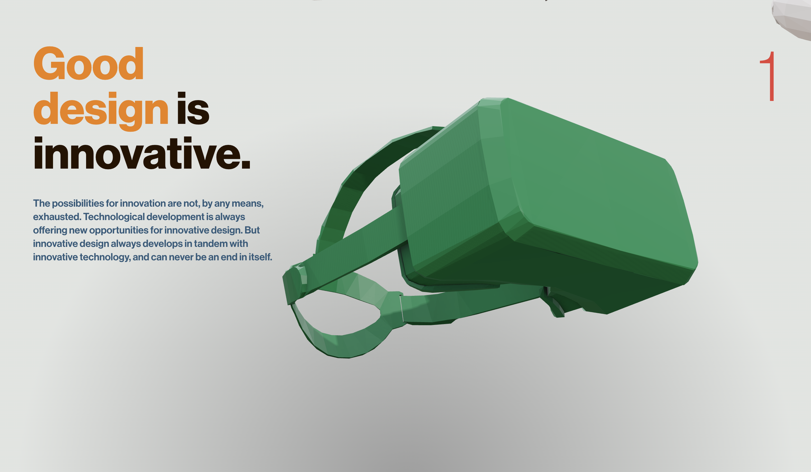

# Dieter Rams’ 10 Design Principles in 3D (WIP)

A lightweight three.js project showcasing Dieter Rams’ ten design principles through an interactive 3D animation.

---

## Overview

This repository contains a three.js‐based web experience that highlights the essence of Dieter Rams’ famous design principles. Each principle is represented by a 3D scene or animation, allowing you to explore and interact with the concepts in a visual, immersive way.

---

## Live Demo

A working (but still evolving) version is deployed on Vercel:
[https://ten-principles.vercel.app/](https://ten-principles.vercel.app/)

---

## Screenshot



---

## Status

- **Work in Progress**: Animations and 3D models are actively being refined.
- As long as this README remains unchanged, development is ongoing.
- Feel free to check back for updates—new features, improved models, and smoother animations are on the way.

---

## Technologies

- **three.js** for rendering 3D scenes in the browser
- **JavaScript (ES6+)** for project logic
- **GLTF/GLB models** for 3D assets
- **Vercel** for deployment and hosting

---

## Getting Started

1. **Clone the repo**  
   ```bash
   git clone git@github.com:Alexis-NM/ten-principles.git
   cd your-repo
   ```

2. **Install dependencies**  
   ```bash
   npm install
   ```

3. **Run locally**  
   ```bash
   npm run dev
   ```
   Open [http://localhost:5173](http://localhost:5173) in your browser.

4. **Build for production**  
   ```bash
   npm run build
   npm run start
   ```

---

## Contributing

- All contributions are welcome!  
- If you’d like to help improve animations or 3D models, please open an issue or submit a pull request.
- Check the “Issues” tab for ongoing tasks and feature requests.

---

## License

This project is released under the [MIT License](LICENSE).

---

> **Note:** As long as this README hasn’t been updated, the project is still in active development.
